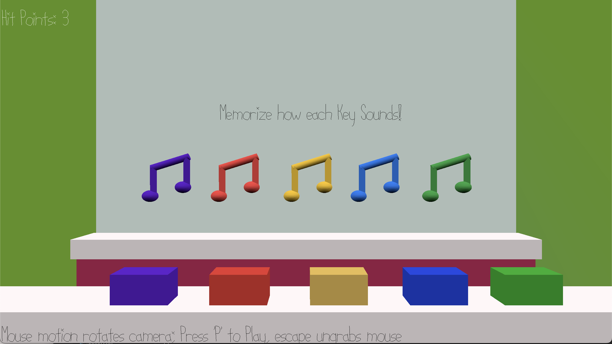

# Music Match Mania

Author: Jose Lima

Design: A matching game, where instead of objects, you match sounds. The player must 
familiarize themselves with all key note sounds (5 in total). Once the game starts, then the
player will have to listen and memorize the current music sheet, and match them in the correct order.

Screen Shot:

How To Play:

Memorize how each key note sounds like before starting the game.

* 'A' Key: Purple
* 'S' Key: Red
* 'Space' Key: Yellow
* 'K' Key: Blue
* 'L' Key: Green

Once you are familar with the sounds press 'P' to start the game.

Listen carefully and memorize the order and sounds the game plays. 

Once the sounds stop playing, you will have to match them in the right order. 

If you miss you lose a hitpoint. If you match all notes, then you win. 

This game was built with [NEST](NEST.md).
